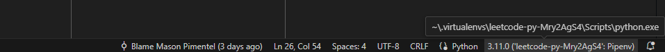
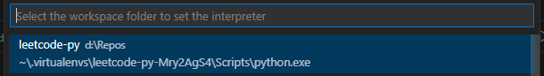
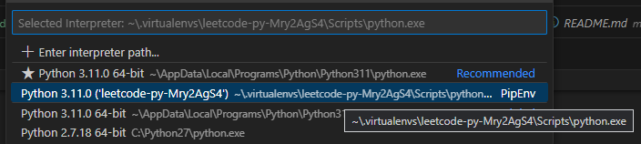

In VS Code to fix import lint error, set the interpreter to the one in your virtual env:

 |
------------ | 
_Step 1 - click here on the bottom right part in VS Code_ | 

 |
------------ | 
_Step 2_ - select your current workspace | 

 |
------------ | 
_Step 3_ - set this to the right interpreter | 

## Running

`pipenv run python main.py`

## Testing

### Run tests

`pipenv run pytest`

### Get coverage report

`pipenv run coverage report -m`